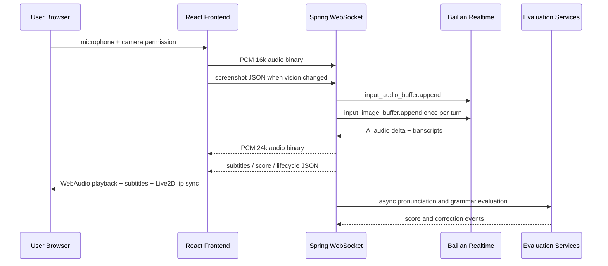

视频连接（飞书 模糊画质）：https://icnqirc7uv98.feishu.cn/drive/folder/HDdGf7BpzlQiETd8OFDcV9fHnle
视频连接地址（b站 高清版本）：在等审核
前端仓库地址：https://github.com/Ackenieo/live2D-language-coach-frontend


# 题目一：AI 视觉对话助手

本项目实现了一款面向英语口语陪练场景的 AI 视觉对话助手：用户在浏览器中开启麦克风和摄像头，与 AI 进行实时语音对话；AI 可以接收用户语音和摄像头画面上下文，返回流式语音、字幕、纠错和评分反馈。前端使用 Live2D 角色承载对话体验，后端使用 Spring Boot 按 DDD 分层组织实时对话、用户、评测、会话报告和排行榜模块。

项目名称：`TalkTic / live2D-language-coach`

## 选题要求对照

| 选题要求 | 本项目实现 |
|---|---|
| 打开摄像头 | 前端通过 `navigator.mediaDevices.getUserMedia` 获取摄像头权限，隐藏本地视频预览，定时截图后通过 WebSocket 发送视觉上下文 |
| 打开麦克风 | 前端采集 16 kHz 单声道 PCM Int16 音频，实时推送到后端 WebSocket |
| AI 看到视频内容 | 前端将低分辨率 JPEG 帧发送给后端，后端在视觉模式开启时把最新画面作为图片上下文转发给百炼实时模型 |
| AI 听到用户说话 | 后端把麦克风音频流转发到百炼 Realtime API，由模型完成语音识别与多模态对话 |
| AI 恰当回应 | 后端转发 AI 流式语音与字幕；前端用 WebAudio 播放语音，用字幕和 Live2D 表情/嘴型呈现回应 |
| 视觉理解准确性 | 采用按轮次发送最新画面、场景提示词和视觉开关，避免过期帧干扰模型判断 |
| 语音自然度与流畅性 | 二进制音频流式转发，前端提前调度音频播放，并用实际播放音量驱动 Live2D 嘴型 |
| 端云协同成本控制 | pHash 去重、240x180 JPEG、视觉开关、每轮只发送最新帧、Redis 会话记忆 TTL、Sentinel 限流、评分异步化 |
| 额外设计文档 | 见 [docs/designed/ai-vision-dialogue-assistant-design.md](docs/designed/ai-vision-dialogue-assistant-design.md) |

## 核心功能

- 实时语音对话：浏览器采集麦克风音频，经 `/ws/bailian` 推送到后端，后端连接百炼 Realtime API，AI 音频以 WebSocket 二进制流返回。
- 摄像头视觉输入：前端隐藏视频预览，仅发送去重后的低清截图；后端维护每个会话的最新图片队列，并在用户发言轮次中发送给模型。
- Live2D 角色互动：前端加载 `public/live2D/yumi` 模型，根据 AI 字幕推断表情，并根据实际音频播放能量和字幕元音近似生成嘴型。
- 实时字幕与反馈：展示用户 ASR 字幕、AI 流式字幕、发音评分和语法纠错结果。
- 会话报告：结束通话后聚合准确度、流利度、完整度和综合评分，生成建议并保存历史记录。
- 用户体系：短信验证码登录、JWT/Refresh Token、个人资料、头像上传、手机号换绑。
- 学习数据看板：历史会话、排行榜、我的排名。
- 运营保护：REST 与 WebSocket 限流、会话记忆 TTL、音频/视觉链路低开销传输。

## 技术栈

### 后端

- Java 17
- Spring Boot 3.5.14
- Spring WebSocket
- MyBatis-Plus 3.5.7
- MySQL 8.0
- Redis / Redisson
- Sentinel 限流
- 阿里云百炼 Realtime API
- 腾讯智聆发音测评
- 豆包文本纠错
- 阿里云 OSS 头像存储

### 前端

- React 19
- TypeScript
- Vite
- React Router
- PixiJS + pixi-live2d-display
- WebAudio API
- MediaDevices API
- Lucide React

## 项目结构

```text
.
├── src/main/java/com/ackenieo/init_pro
│   ├── user/                 # 登录、JWT、用户资料、手机号、头像
│   ├── realtime/             # WebSocket、百炼实时客户端、前端图片队列
│   ├── conversation/         # 会话、消息、报告、历史、排行榜、提示词
│   ├── evaluation/           # 发音测评、语法纠错、轮次音频缓存
│   ├── oss/                  # OSS 上传抽象与阿里云实现
│   └── shared/               # 通用响应、异常、限流、安全、MyBatis 配置
├── frontend
│   ├── src/pages/            # Welcome、Call、Summary、History、Leaderboard、Profile
│   ├── src/modules/media/    # 音频采集、视觉采集、WebSocket、speech-link
│   ├── src/modules/live2d/   # Live2D 渲染、表情、嘴型参数
│   ├── src/modules/auth/     # 登录页面
│   └── public/live2D/yumi/   # Live2D 模型资源
├── docs
│   ├── api/api-reference.md
│   └── designed/
├── data/schema.sql           # 数据库建表脚本
└── docker-compose.yml        # MySQL、Redis、Sentinel Dashboard
```

## 架构说明

后端按 DDD 风格拆分，核心依赖方向为：

```text
interfaces -> application -> domain <- infrastructure
```

- `interfaces`：REST Controller、WebSocket Handler、DTO。
- `application`：跨领域用例编排，例如会话结束聚合、用户资料更新、历史查询。
- `domain`：会话、消息、用户、评分结果、仓储接口、领域服务。
- `infrastructure`：MyBatis-Plus 持久化、Redis 会话记忆、百炼/腾讯/豆包/OSS 外部服务适配。

实时对话链路：



## 运行方式

### 1. 启动基础设施

```bash
docker-compose up -d
```

默认端口：

| 服务 | 端口 |
|---|---|
| Spring Boot | `8520` |
| MySQL | `3381` |
| Redis | `6454` |
| Sentinel Dashboard | `8858` |
| Vite | `5173` |

### 2. 初始化数据库

```powershell
Get-Content .\data\schema.sql | docker exec -i live2d-language-coach-mysql mysql -uroot -proot123456
```

### 3. 配置外部服务

实时 AI 对话需要配置百炼 API；发音测评、语法纠错、头像上传分别依赖腾讯智聆、豆包和 OSS。建议通过环境变量或本地未提交配置提供密钥：

```text
BAILIAN_API_KEY
TENCENT_SOE_APP_ID
TENCENT_SOE_SECRET_ID
TENCENT_SOE_SECRET_KEY
DOUBAO_API_KEY
OSS_ACCESS_KEY_ID
OSS_ACCESS_KEY_SECRET
```

提交或公开项目时不要把真实密钥写入仓库。

### 4. 启动后端

```powershell
.\mvnw.cmd spring-boot:run
```

### 5. 启动前端

```bash
cd frontend
npm install
npm run dev
```

浏览器访问：

```text
http://127.0.0.1:5173
```

Vite 已代理：

- `/api` -> `http://localhost:8520`
- `/ws` -> `ws://localhost:8520`

## 测试与构建

后端测试：

```powershell
.\mvnw.cmd test
```

后端打包：

```powershell
.\mvnw.cmd package
```

前端构建：

```bash
cd frontend
npm run build
```

## 主要接口

完整接口见 [docs/api/api-reference.md](docs/api/api-reference.md)。

### REST

| 方法 | 路径 | 说明 |
|---|---|---|
| `POST` | `/api/auth/sms/send` | 发送短信验证码 |
| `POST` | `/api/auth/login` | 手机号验证码登录 |
| `POST` | `/api/auth/refresh` | 刷新 Token |
| `GET` | `/api/user/profile` | 获取用户资料 |
| `PUT` | `/api/user/profile` | 修改昵称 |
| `PUT` | `/api/user/phone` | 换绑手机号 |
| `POST` | `/api/user/avatar` | 上传头像 |
| `GET` | `/api/chat/report/{sessionId}` | 获取会话报告 |
| `GET` | `/api/chat/history` | 获取历史会话 |
| `GET` | `/api/leaderboard` | 获取排行榜 |
| `GET` | `/api/leaderboard/my-rank` | 获取我的排名 |

### WebSocket

连接地址：

```text
ws://localhost:8520/ws/bailian?token=<accessToken>
```

前端发送：

```json
{ "type": "config", "scene": "hotel", "difficulty": "medium", "accent": "us", "vision": "on" }
```

```json
{ "type": "screenshot", "image": "data:image/jpeg;base64,..." }
```

```json
{ "type": "finish" }
```

二进制消息为用户麦克风 PCM Int16、16 kHz、单声道音频。

后端返回：

```json
{ "type": "ai_subtitle", "text": "Certainly" }
```

```json
{ "type": "pronunciation_score", "suggestedGrade": "B", "accuracyGrade": "B", "fluencyGrade": "B", "completionGrade": "B" }
```

```json
{ "type": "session_end", "sessionId": "uuid", "overallGrade": "B", "suggestions": ["注意时态一致性"] }
```

二进制消息为 AI 回复 PCM Int16、24 kHz 音频。

## 数据表

- `t_user`：用户、手机号、昵称、头像、综合分。
- `t_chat_session`：会话配置、结束时间、会话级评分、建议、时长、消息数。
- `t_chat_message`：用户/AI 消息、轮次 ID、逐轮发音评分字段。

## 成本控制策略

本项目没有把摄像头视频原样持续上传到云端，而是采用端云协同：

- 前端只发送 240x180、质量 0.2 的 JPEG 截图。
- 用 pHash 判断画面变化，相似画面不重复上传。
- 后端每轮只把最新一张图片发送给模型，避免堆积旧帧。
- 摄像头有独立开关，关闭后只走语音链路。
- AI 音频返回使用 WebSocket 二进制帧，避免 JSON/base64 放大。
- Live2D 嘴型在浏览器本地根据音频能量和字幕生成，不额外调用云端 lip-sync。
- Redis 会话记忆限制最大消息数与 TTL。
- Sentinel 对高成本接口和 WebSocket 握手做限流。
- 发音测评和语法纠错异步执行，不阻塞实时语音响应。

## 当前限制

- 视觉能力采用“摄像头截图 + 多模态模型”的方式，不是连续视频流理解。
- 前端当前对场景/难度/口音的选择 UI 尚未完全展开，后端提示词模板和 WebSocket 配置已支持。
- 发音测评、语法纠错、OSS 上传依赖外部服务密钥；未配置时相关能力会降级或不可用。
- 会话建议目前主要来自语法纠错结果和评分阈值聚合，后续可升级为完整报告生成模型。

## 设计文档

- 选题设计文档：[docs/designed/ai-vision-dialogue-assistant-design.md](docs/designed/ai-vision-dialogue-assistant-design.md)
- 实时语音链路设计：[docs/designed/speech-link.md](docs/designed/speech-link.md)
- 早期产品设计：[docs/designed/live2d-language-coach-design.md](docs/designed/live2d-language-coach-design.md)
